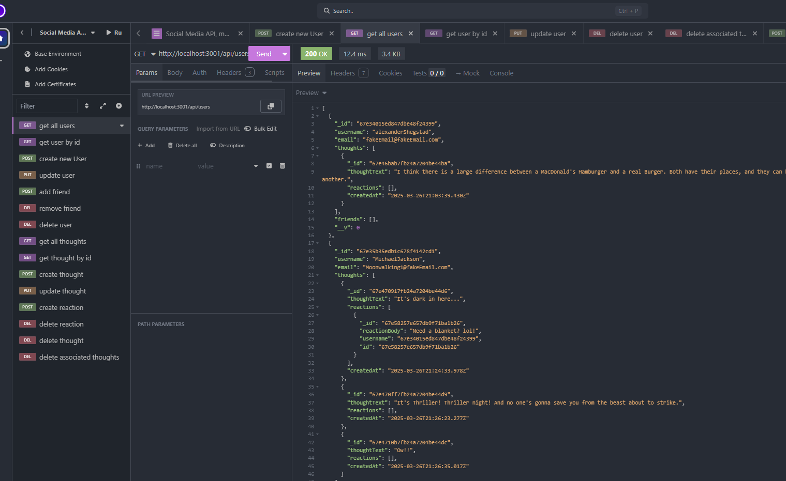
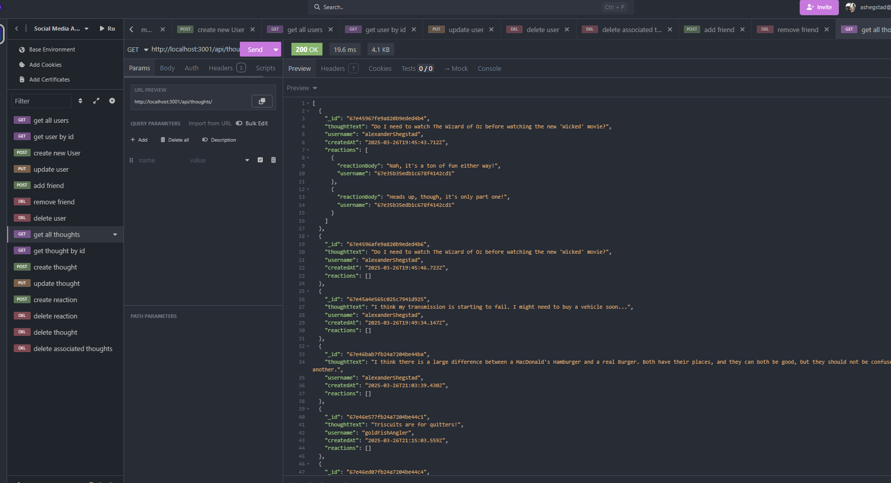

# socialMediaApp_Mod17
Social Media Backend application, using Express, MongoDB and Mongoose.

## Features
This API provides the following features:
- **User Management**: Create, read, update, and delete users.
- **Friendship Management**: Add and remove friends for a user.
- **Thoughts**: Create, read, update, and delete thoughts (posts).
- **Reactions**: Add and remove reactions to thoughts.

## Intended Use
This API is designed to serve as the backend for a social media application. It allows developers to manage users, their posts (thoughts), and interactions (reactions and friendships) efficiently using MongoDB and Mongoose.

## Usage Instructions
1. Clone the repository:
    ```bash
    git clone https://github.com/yourusername/socialMediaApp_Mod17.git
    ```
2. Install dependencies:
    ```bash
    npm install
    ```
3. Start the server:
    ```bash
    npm start
    ```
4. Use a tool like Postman or Insomnia to interact with the API endpoints.

## API Endpoints
- **Users**:
  - `GET /api/users`: Get all users.
  - `GET /api/users/:id`: Get a single user by ID.
  - `POST /api/users`: Create a new user.
  - `PUT /api/users/:id`: Update a user by ID.
  - `DELETE /api/users/:id`: Delete a user by ID.
  - `POST /api/users/:userId/friends/:friendId`: Add a friend.
  - `DELETE /api/users/:userId/friends/:friendId`: Remove a friend.

- **Thoughts**:
  - `GET /api/thoughts`: Get all thoughts.
  - `GET /api/thoughts/:id`: Get a single thought by ID.
  - `POST /api/thoughts`: Create a new thought.
  - `PUT /api/thoughts/:id`: Update a thought by ID.
  - `DELETE /api/thoughts/:id`: Delete a thought by ID.
  - `POST /api/thoughts/:thoughtId/reactions`: Add a reaction to a thought.
  - `DELETE /api/thoughts/:thoughtId/reactions/:reactionId`: Remove a reaction from a thought.

## Contributing
Contributions are welcome! To contribute:
1. Fork the repository.
2. Create a new branch for your feature or bugfix:
    ```bash
    git checkout -b feature-name
    ```
3. Commit your changes and push the branch:
    ```bash
    git commit -m "Add feature-name"
    git push origin feature-name
    ```
4. Open a pull request.

## License
This project is licensed under the MIT License. See the [LICENSE](LICENSE) file for details.

## Screenshots



## Walkthrough Video
[Checkout this walkthrough via Insomnia](https://drive.google.com/file/d/1hdJ9odHutRyrFZ2o3_KkbZw8QdE7JFmj/view?usp=sharing)